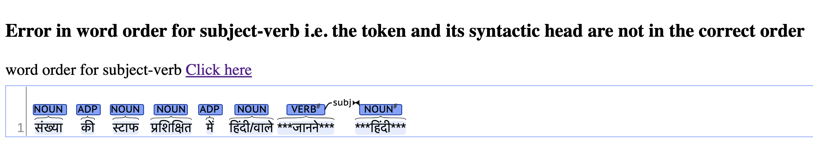
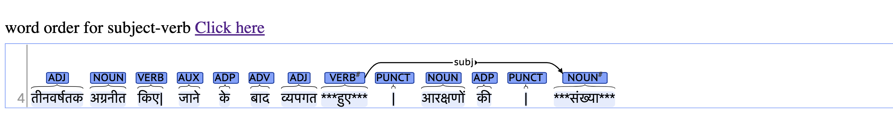

# Morphological Evaluation of NLG

L'AMBRE is a tool to measure the grammatical well-formedness of texts generated by NLG systems. It analyzes the dependency parses of the text using morpho-syntactic rules, and returns a well-formedness score. This tool utilizes the Surface Syntactic Universal Dependency ([SUD](https://surfacesyntacticud.github.io)) project both for extracting rules as well as parsing, and is therefore applicable across languages. See our [EMNLP 2021 paper](https://aclanthology.org/2021.emnlp-main.570/) for more details.

## Getting Started

### Install dependencies

```bash
python setup.py install
```

### Try L'AMBRE

For a given input text file, `lambre` computes a morpho-syntactic well-formedness score [0-1]. The following command first downloads the parsers and rule sets for the specified language before computing the document-level score.

```bash
# lambre <lg> <txt file>
lambre ru data/txt/ru.txt # Russian
lambre de data/txt/de.txt # German
lambre en data/txt/en.txt # English
```

Run `lambre --help` for more options.

## Morpho-syntactic Rules

`lambre` currently supports two rule sets, `chaudhary-etal-2021` (see [Chaudhary et al., 2020](https://aclanthology.org/2020.emnlp-main.422/), [2021](https://aclanthology.org/2021.emnlp-main.553/)) and `pratapa-etal-2021` (see [Pratapa et al., 2021](https://aclanthology.org/2021.emnlp-main.570)). The former is the default, but the rule set can be specified using `--rule-set` option.

## Visualization Examples

In addition to the metric, we output the erroneous sentences in two formats:i) `errors.txt` and ii) `errors*.html`. These are stored in the `out/errors`.
`errors.txt` shows the errors in a txt file, while the `*html` file visualizes the errors in a html which you can visualize by simply opening it using any browser.
Here is a snippet of how a sample output looks like, we ran the metric on 1000 example sentences from the [Samanantar corpus](https://indicnlp.ai4bharat.org/samanantar/) for Hindi, and here are some examples of erroneous sentences:
```
Input sentence: संख्या की स्टाफ प्रशिक्षित में हिंदी/वाले जानने हिंदी
                 (Stenography Hindi in trained persons of No.)
                 
                 तीनवर्षतक अग्रनीत किए| जाने के बाद व्यपगत हुए| आरक्षणों की| संख्या
                 (of after forward No. reservations lapsed carrying for 3 years)
```
Command:
``` 
lambre hi examples/hi_sents_1k.txt --rule-set chaudhary-etal-2021 ```
```
Example Output:
```
generating SUD parse for the input document
storing .conllu file at out/ocr_hi_sents_1k.conllu
computing document-level lambre score
lambre score: 0.8821
writing grammatical errors to out/errors
```
This will generatee separate html files for word order, agreement and case marking, as shown in `examples/`.
Sample Visualization output of word order:
.

.
## Parser

We provide SUD parsers trained using [Stanza](https://stanfordnlp.github.io/stanza/) toolkit. See section 4 in [our paper](https://aclanthology.org/2021.emnlp-main.570) for more details.

## Supported Languages

We currently support the following languages. `lambre` command automatically downloads the necessary language-specific resources (when available). Alternatively, `lambre-download <lg>` command can be used to download the same.

| Language     | Code | Language     | Code | Language     | Code | Language     | Code |
| --------     | ---- | --------     | ---- | --------     | ---- | --------     | ---- |
| Catalan      | ca   | Spanish      | es   | Italian      | it   | Russian      | ru   |
| Czech        | cs   | Estonian     | et   | Latvian      | lv   | Slovenian    | sl   |
| Danish       | da   | Persian      | fa   | Dutch        | nl   | Swedish      | sv   |
| German       | de   | French       | fr   | Polish       | pl   | Ukrainian    | uk   |
| Greek        | el   | Hindi        | hi   | Portuguese   | pt   | Urdu         | ur   |
| English      | en   | Indonesian   | id   | Romanian     | ro   |              |      |

## Reference

If you find this toolkit helpful in your research, consider citing our paper,

```bib
@inproceedings{pratapa-etal-2021-evaluating,
    title = "Evaluating the Morphosyntactic Well-formedness of Generated Texts",
    author = "Pratapa, Adithya  and
      Anastasopoulos, Antonios  and
      Rijhwani, Shruti  and
      Chaudhary, Aditi  and
      Mortensen, David R.  and
      Neubig, Graham  and
      Tsvetkov, Yulia",
    booktitle = "Proceedings of the 2021 Conference on Empirical Methods in Natural Language Processing",
    month = nov,
    year = "2021",
    address = "Online and Punta Cana, Dominican Republic",
    publisher = "Association for Computational Linguistics",
    url = "https://aclanthology.org/2021.emnlp-main.570",
    pages = "7131--7150",
}
```

We also encourage you to cite the original works for the `chaudhary-etal-2021` ruleset, [Chaudhary et al., 2020](https://aclanthology.org/2020.emnlp-main.422/) and [Chaudhary et al., 2021](https://aclanthology.org/2021.emnlp-main.553/).

## License

L'AMBRE is available under MIT License. The code for training parsers is adapted from [stanza](https://github.com/stanfordnlp/stanza), which is available under Apache License, Version 2.0.

## Issues

For any issues, questions or requests, please use the [Github Issue Tracker](https://github.com/adithya7/lambre/issues).
